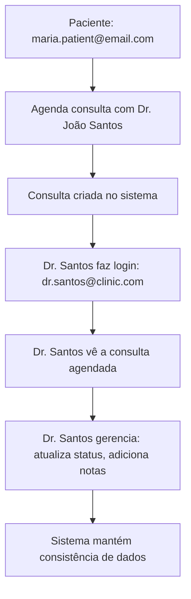

# Testes E2E Fidedignos - Sistema de Consultas Médicas

## 🎯 Objetivo dos Testes Fidedignos

Os testes foram reestruturados para serem mais **fidedignos** e **consistentes**, simulando o fluxo real de um sistema de consultas médicas onde:

1. **Paciente** agenda consulta com **médico específico**
2. **Mesmo médico** consegue ver e gerenciar essa consulta
3. Dados são **consistentes** entre as perspectivas do paciente e do médico

## 🏥 Médicos Disponíveis no Sistema

Conforme o `backend/src/scripts/seed.js`, temos os seguintes médicos:

| Email                    | Nome                | Especialidade    | Senha       |
| ------------------------ | ------------------- | ---------------- | ----------- |
| `dr.silva@clinic.com`    | Dr. Maria Silva     | Cardiologia      | Password123 |
| `dr.santos@clinic.com`   | **Dr. João Santos** | **Dermatologia** | Password123 |
| `dr.oliveira@clinic.com` | Dra. Ana Oliveira   | Pediatria        | Password123 |
| `dr.costa@clinic.com`    | Dr. Carlos Costa    | Ortopedia        | Password123 |

## 🔄 Estratégia de Testes Consistente

### **Dr. João Santos como Médico Padrão**

Escolhemos o **Dr. João Santos** como médico padrão para todos os testes porque:

-   ✅ Está disponível no banco de dados
-   ✅ Tem especialidade definida (Dermatologia)
-   ✅ Permite testes consistentes entre agendamento e gerenciamento
-   ✅ Evita inconsistências entre diferentes médicos nos testes

### **Fluxo Fidedigno Implementado**



## 📁 Estrutura de Testes Atualizada

### **1. Agendamento de Consultas**

-   **Arquivo**: `appointments/appointment_schedule.cy.js`
-   **Objetivo**: Paciente agenda especificamente com **Dr. João Santos**
-   **Diferencial**: Seleciona médico por nome, não por posição na lista

### **2. Dashboard do Médico**

-   **Arquivo**: `app/doctor_dashboard.cy.js`
-   **Objetivo**: **Dr. João Santos** vê seu dashboard personalizado
-   **Diferencial**: Verifica dados específicos do Dr. Santos

### **3. Consultas de Hoje**

-   **Arquivo**: `app/doctor_today_appointments.cy.js`
-   **Objetivo**: **Dr. João Santos** gerencia consultas do dia
-   **Diferencial**: Focado na perspectiva do Dr. Santos

### **4. Gerenciamento de Consultas**

-   **Arquivo**: `app/doctor_appointments.cy.js`
-   **Objetivo**: **Dr. João Santos** gerencia todas suas consultas
-   **Diferencial**: Verifica que só vê pacientes, não outros médicos

### **5. Fluxo Completo E2E**

-   **Arquivo**: `complete-flow/patient-doctor-flow.cy.js`
-   **Objetivo**: Demonstra o fluxo completo fidedigno
-   **Diferencial**: Testa a jornada completa do início ao fim

## 🔍 Principais Melhorias dos Testes

### **1. Seleção Específica de Médico**

```javascript
// ❌ Antes (não fidedigno)
cy.get('[data-testid="doctor-option"]').eq(0).click()

// ✅ Agora (fidedigno)
cy.contains('[data-testid="doctor-option"]', 'Dr. João Santos').click()
```

### **2. Verificação de Perspectiva do Médico**

```javascript
// ✅ Dr. Santos NÃO deve ver seu próprio nome nos cards
cy.get('body').should('not.contain.text', 'Dr. João Santos')

// ✅ Dr. Santos deve ver nomes dos pacientes
cy.get('body').should('contain.text', 'Maria Santos')
```

### **3. Rastreamento de Consultas**

```javascript
// ✅ Usa identificador único para rastrear consultas
const testNote = `E2E Test Dr. Santos - ${new Date().getTime()}`
cy.get('textarea[id="notes"]').type(testNote)
```

## 🧪 Como Executar os Testes Fidedignos

### **Executar Teste Completo**

```bash
# Executa o fluxo completo paciente → médico
npx cypress run --spec "cypress/e2e/complete-flow/patient-doctor-flow.cy.js"
```

### **Executar Suite Atualizada**

```bash
# Executa todos os testes atualizados
npx cypress run --spec "cypress/e2e/appointments/appointment_schedule.cy.js,cypress/e2e/app/doctor_*.cy.js,cypress/e2e/complete-flow/*.cy.js"
```

### **Executar em Modo Interativo**

```bash
# Para debug e desenvolvimento
npx cypress open
```

## ✅ Validações dos Testes Fidedignos

### **Agendamento (Paciente)**

-   ✅ Seleciona **Dr. João Santos** especificamente
-   ✅ Verifica que consulta é criada com médico correto
-   ✅ Aparece na lista de consultas do paciente

### **Gerenciamento (Dr. Santos)**

-   ✅ Login com `dr.santos@clinic.com` funciona
-   ✅ Dashboard mostra **Dr. João Santos** logado
-   ✅ Vê consultas agendadas **para ele**
-   ✅ **NÃO** vê seu próprio nome nos cards de consulta
-   ✅ Vê **nomes dos pacientes** nos cards
-   ✅ Consegue atualizar status das consultas
-   ✅ Consegue adicionar notas médicas

### **Consistência de Dados**

-   ✅ Consulta agendada pelo paciente aparece para o médico
-   ✅ Atualizações do médico são persistidas
-   ✅ Perspectivas são consistentes (paciente vê médico, médico vê paciente)

## 🎭 Cenários de Teste

### **Cenário 1: Fluxo Principal**

1. Maria Santos agenda consulta com Dr. João Santos
2. Dr. Santos vê a consulta no seu painel
3. Dr. Santos atualiza status para "Concluída"
4. Sistema mantém consistência

### **Cenário 2: Validação de Dados**

-   Médico vê apenas **seus pacientes**
-   Paciente vê apenas **seus médicos**
-   Não há vazamento de dados entre médicos

### **Cenário 3: Gerenciamento**

-   Dr. Santos consegue adicionar notas dermatológicas
-   Status de consulta é atualizado corretamente
-   Histórico é mantido

## 🔧 Configuração Necessária

Certifique-se de que o banco está populado com os dados corretos:

```bash
# No backend
cd backend
pnpm db:seed
```

Isso criará os usuários necessários:

-   **Pacientes**: maria.patient@email.com, joao.patient@email.com
-   **Médicos**: dr.santos@clinic.com, dr.silva@clinic.com, etc.

## 🎯 Próximos Passos

1. **Executar os testes** para verificar o novo fluxo fidedigno
2. **Ajustar** se necessário baseado nos resultados
3. **Expandir** testes para outros médicos se necessário
4. **Integrar** com pipeline de CI/CD

---

**📝 Nota**: Esta reestruturação torna os testes muito mais **confiáveis** e **realistas**, simulando o uso real do sistema onde pacientes agendam com médicos específicos e esses médicos conseguem gerenciar suas consultas.
